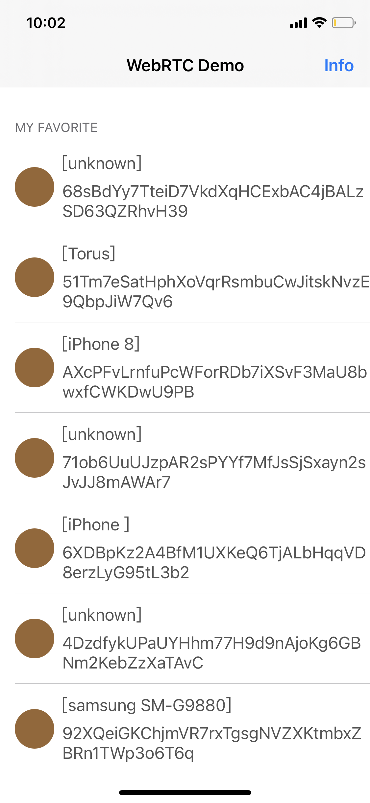
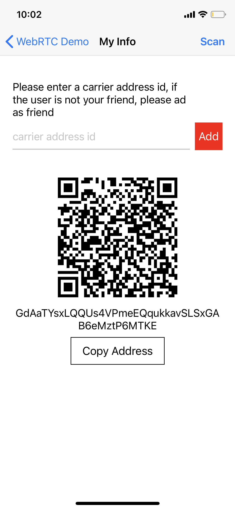
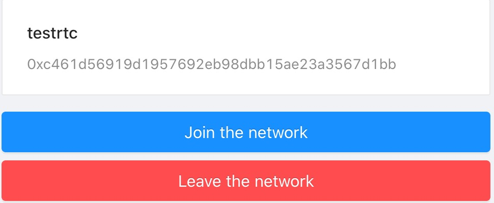
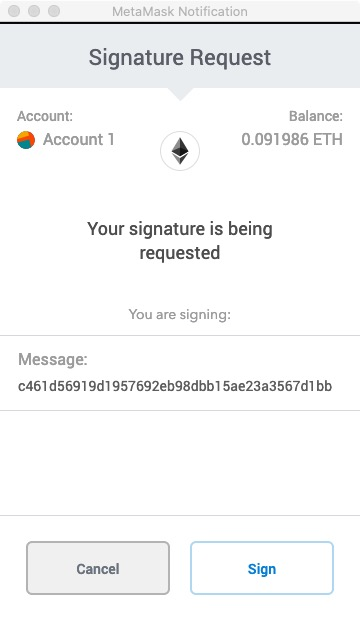
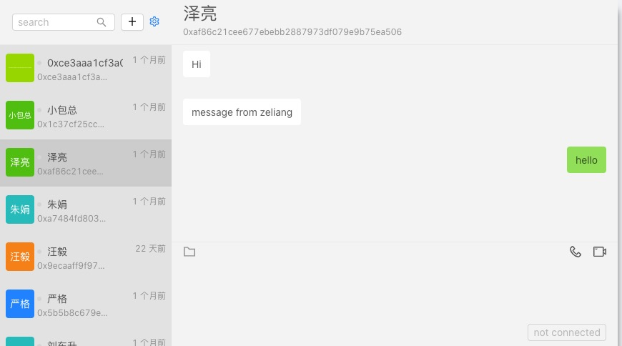
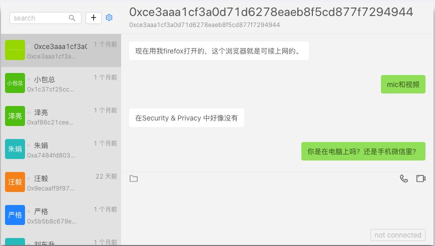

# Club Chat

* **Project:** Club Chat

## Project Overview : 

### Overview

Please provide the following:
  * A brief description of the project.
   
  * Club Chat is a decentralized, censorship free real time instant messenger with audio/vedio function. 
 Unlike most instant messenger app today, there is no central account system for users, it uses DID(Decentralized Identifier) as the indentity and signature to secure.  
 There is no server either, it will be the blockchain nodes for the messaging relay and route, so there is no service nor maintenance team needed to keep the system running. 
 There is no single point failure.
 Privacy, Security and Censorship-resustance is our goal.
  Censorship-resistance is considered to be one of the main value propositions of Bitcoin. 
  The idea is that no nation-state, corporation, or third party has the power to control who can use the network. 
  Censorship-resistance ensures that the laws that govern the network are set in advance and can’t be retroactively altered to fit a specific agenda.
  * Unlike most messaging app founded in crypto world such as hopr, status, ally/scrumble, we are focus on user experience, 
  and we are developing the front end app instead of background technologies. Our target is to make it used by people in crypto world. 

  * An indication of how you will integrate this project into Substrate / Polkadot / Kusama.
  
  * We will use the address in Substrate/Polkadot as the identity of the messaging part.
  We are going to use the peer to peer messaging technologies provided by substrate.

  * An indication of why your team is interested in creating this project.
  * In the past few years, the technology and infrastructure of decentralization have made considerable progress,
   but the crypto world is still using traditional communication tools such as WeChat Communication. 
   Encouraged by uniswap which build pure decentralized exchange on Ethereum, we are going to build decentralized instant messenger 
   on top of the existing peer to peer network exsited in most blockchain.
   As most people still reply on centralized exchanges to trade cryptocurrencies, 
   we are facing the same problem and difficulty as most instant messenger are domanated by single platform and commercial company.
   In stead of chalendge most existing instant messenger, we are going to use the technologies developed by cryto workd and serve people in crtpto world. 
   the user scale of encrypted currency is at least hundreds of thousands or even millions, it is big enough for us at this stage. 
   Technically, the messaging technologies is the underline technologies in every blockchain such as Substrate in Polkadot, Whishper in Ethereum, Carrier in Elastos carrier and it can be used to implement peer to peer messaging.. 
   Based on cryptography, smart contracts, and peer-to-peer communication technologies, it is possible to build a decentralized instant messaging system with ensorship-resistance, which means it can not regulated and 
   controlled by any commercial organization. 

### Project Details 
We expect the teams to already have a solid idea about the project's expected final state.

Therefore, we ask the teams to submit (where relevant):
* Mockups/designs of any UI components






* API specifications of the core functionality
* WebRTC replys on sigaling protocol to connect peers to build WebRTC connection.
We define and implement a simple protocol to build audio/vedio conversation and send data between peers.
THis protocal can be implemented by underline messaging protocol such as carrier in Elastos and whisper in Ethereum.
It can be implemeneted using the function provided by substrate as well.

### WebRTC Sigaling Protocol

| type               | sdp      | candidates | reason   | options  |
|--------------------|----------|------------|----------|----------|
| offer              | required | -          | -        | required |
| answer             | required | -          | -        | -        |
| candidate          | -        | required   | -        | -        |
| removal-candidates | -        | required   | -        | -        |
| bye                | -        | -          | required | -        |

### Example
#### 1. Offer

```json
{
	"type":"offer",
	"sdp":"rtc_session_description_generated_by_webrtc",
	"options":["audio","video","data"]
}
```
### 2. Answer
```
{
	"type":"answer",
	"sdp":"rtc_session_description_generated_by_webrtc"
}
```
### 3. Candidate

```
{
	"type":"candidate",
	"candidates": [{
		"sdp": "candidate:684496083 1 udp 1685855999 112.65.48.165 17465 ...",
		"sdpMLineIndex": 0,
		"sdpMid": audio
	}]
}
```
### 4. Removal-Candidate

```
{
	"type":"remove-candidates",
	"candidates": 
	[
		{
			"sdp": "candidate:684496083 1 udp 1685855999 112.65.48.165 17465 ...",
			"sdpMLineIndex": 0,
			"sdpMid": audio
		}, 
		{
			"sdp": "rtc_candiate_desciption",
			"sdpMLineIndex": 0,
			"sdpMid": audio
		}, 
		...
	]
}
```
### 5. Bye

```
{
	"type":"bye"
	"reason": "reject"
}
```

### 6. Send Data by datachannel
```
{
	"fileId": UUID,  //created from the UUID, such as "E621E1F8-C36C-495A-93FC-0C247A3E6E5F"
	"index": Int, //当前发送文件的切片索引
	"mime": String, //Multipurpose Internet Mail Extensions，
	"data": String, //data Base-64 encoded string.
}
```

* An overview of the technology stack to be used
DID is used as the address of the instant messenger, it generated on the user's device in stead of central server.
It can also be any address in a Ethereum wallet and it need the signature of the walller.
The Audio/Vedio and Data communicate is done by WebRTC, which is an open source project from Google.
With WebRTC, you can add real-time communication capabilities to your application that works on top of an open standard. It supports video, voice, and generic data to be sent between peers, allowing developers to build powerful voice- and video-communication solutions. The technology is available on all modern browsers as well as on native clients for all major platforms. The technologies behind WebRTC are implemented as an open web standard and available as regular JavaScript APIs in all major browsers. For native clients, like Android and iOS applications, a library is available that provides the same functionality. The WebRTC project is open-source and supported by Apple, Google, Microsoft and Mozilla, amongst others.
WebRTC does not work alone and it needs a signaling protocol to help the peer to find each other
and build the initial connection.
There is peer to peer messaging system in most blockchain system so we can use it
to be the signaling platform for WebRTC peers. 
* Documentation of core components, protocols, architecture etc. to be deployed
### 1. App
#### App for IOS and Android, a web client with a metamask plugin or dapp in 
wallet which support WebRTC.
Those app is heavyly reply on WebRTC. The WebRTC standard covers, 
on a high level, two different technologies: media capture devices and peer-to-peer connectivity.
Media capture devices includes video cameras and microphones, but also screen capturing "devices".
 For cameras and microphones, we use navigator.mediaDevices.getUserMedia() to capture MediaStreams. For screen recording, we use navigator.mediaDevices.getDisplayMedia() instead.
The peer-to-peer connectivity is handled by the RTCPeerConnection interface. 
This is the central point for establishing and controlling the connection between two peers in WebRTC.

### 2. Messaging network
#### requirement of instant messaging 
1. broadcasting
2. offline messaging
3. online peer to peer messaging
While Ethereum Whisper support number 1 and 2 in the above list; 
Number 3 needs something like ElastOS Carrier or something similar, such as lower API like The RLPx Transport Protocol.
Peer to peer offline messaging and storage server can be implemented on top of #3.

### 3. Turn server
The term stands for Traversal Using Relay NAT, and it is a protocol for relaying network traffic.
### 4. Push Notification Server
Since most apps are forced to be offline when it is switched to background, we need to use
the messaging channel of the Phone device. On IOS it is APNS and Voice Push Notification service,
on Android it is called FCM, Firebase Cloud Messaging 
### 5. Token
The Club token is a modular utility token that fuels the Club Chat network. 
This includes a Decentralized Push Notification and Advertise Market, Governance of the Club client, Incentives of Messaging, Turn Server and Notification Nodes.
the Club Token will leverage our economic attention to build the network effect of an open platform.

* PoC/MVP or other relevant prior work or research on the topic


### Ecosystem Fit 
Are there any other projects similar to yours? If so, how is your project different?

## Team :busts_in_silhouette:

### Team members
* Name of team leader: Wei Li
* Names of team members: Yi Wang

### Team Website	
* http://t.callt.net
* https://www.callpass.cn/metamask

### Legal Structure 
Please provide the name and registered address of the legal entity executing the project. When applying via the General Grants program, these details can also be shared privately via the Google Form used for your application.
Shanghai Allcom Network Technologies
Suite 11-205, Guoshoujing Road, PuDong, Shanghai, PRC 201203
### Team's experience
Please describe the team's relevant experience.  If the project involves development work, then we'd appreciated if you can single out a few interesting code commits made by team members on their past projects. For research-related grants, references to past publications and projects in a related domain are helpful.  
 • WebRTC Java/Android SDK: https://github.com/elastos/Elastos.NET.WebRTC.Android.SDK/releases/tag/release-v1.0.0 (https://github.com/elastos/Elastos.NET.WebRTC.Android.SDK/releases/tag/release-v1.0.0)

 • WebRTC Swift/iOS SDK: https://github.com/elastos/Elastos.NET.WebRTC.iOS.SDK/releases/tag/release-v1.0 (https://github.com/elastos/Elastos.NET.WebRTC.iOS.SDK/releases/tag/release-v1.0.0). (https://github.com/elastos/Elastos.NET.WebRTC.iOS.SDK/releases/tag/release-v1.0.0)0 (https://github.com/elastos/Elastos.NET.WebRTC.iOS.SDK/releases/tag/release-v1.0.0)
### Team Code Repos
* https://github.com/allcomsh
* https://github.com/gxyzwangyi

### Team LinkedIn Profiles
* https://www.linkedin.com/in/wei-li-24329451/
* https://www.linkedin.com/in/patrick-wang-b1950678/

## Development Roadmap :nut_and_bolt: 

This section should break out the development roadmap into a number of milestones. Since the milestones will appear in the grant contract, it helps to describe the functionality we should expect, plus how we can check that such functionality exists in the product. Whenever milestones are delivered, we refer to the contract to ensure that everything has been delivered as expected.

Below we provide an **example roadmap**. In the descriptions it should be clear how the project is related to Substrate and/or Polkadot. We recommend that the scope of the work can fit within a 3 month period and that teams structure their roadmap as 1 month = 1 milestone. 

For each milestone:
* Please be sure to include a specification of the software. The level of detail must be enough so that we are able to verify that the software meets the specification.
* Please include total amount of funding requested per milestone.
* Please note that we require documentation (e.g. tutorials, API specifications, architecture details) in each milestone. This ensures that the code can be widely used by the community.
* Please provide a test suite, comprising unit and integration tests, along with a guide on how to run these.
* Please commit to providing a dockerfiles for the delivery of your project. 
* Please indicate the milestone duration, as well as number of Full-Time Employees working on each milestone, and include the number of days along with their cost per day.

### Overview
* **Total Estimated Duration:** Duration of the whole project
* **Full-time equivalent (FTE):**  Workload of an employed person ([see](https://en.wikipedia.org/wiki/Full-time_equivalent)) 
* **Total Costs:** Amount of Payment for the whole project. The total amount of funding needs to be below $100k.

### Milestone 1 Realtime chat using Substrate address
* **Estimated Duration:** 1 month
* **FTE:**  4
* **Costs:** $20,000
* Deliverables: architecture, implementation and documentation detailed publicly on GitHub
* Specification:
* implementation of existing  realtime audio/vedio communication for polkadot/substrate address
* use elastos carrier as the messaging platfoem

### Milestone 2 A token and smart contract system immplemented in Substrate 
* **Estimated Duration:** 2 month
* **FTE:**  4
* **Costs:** $20,000
* Deliverables: White paper of the token destibution, token and smart contact
* Specification:
* issue of CLUB tokens
* smart contract for client communication
* smart contract for miner who run messaging, notification and turn server;

### Milestone 3 Add turn server into substrate network
* **Estimated Duration:** 1 month
* **FTE:**  2
* **Costs:** $10,000

### Milestone 4 Implement push notification server into substrate network
* **Estimated Duration:** 1 month
* **FTE:**  2
* **Costs:** $10,000

### Milestone 5 Investigate and Implement WebRTC singaling messaging in Substrate 
* **Estimated Duration:** 1 month
* **FTE:**  8
* **Costs:** $5,000
* Deliverables: protocol of peer to peer communication,implemented the rust and substrate
* Specification:
* Distributed Peer Table (DPT) / Node Discovery: peer could be any substrate address, Maintain/manage a list of peers, also includes node discovery. 
* Offline messaging


...

### Community engagement

As part of the Program, we require that you produce an article/tutorial and publish it (for example on [Medium](https://medium.com/)). It should explain your work done as part of the grant. 

Normally, we ask you to submit the write-up upon the completion of your grant, although for larger projects it might make sense to publish multiple articles after the completion of different milestones.

## Future Plans
Please include the team's long-term plans and intentions.

In the next two years, We are going to build this instant messaging app for cryto world and we will continue to improve the user experience.

## Additional Information :heavy_plus_sign: 
Any additional information that you think is relevant to this application that hasn't already been included.

Possible additional information to include:
* What work has been done so far?
* Are there are any teams who have already contributed (financially) to the project?
* Have you applied for other grants so far?
